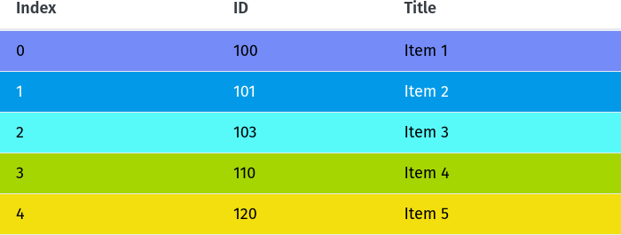

# sortablejs-example

This is a example of [Sortable.js](https://sortablejs.github.io/Sortable/) with [AlpineJS](https://alpinejs.dev/) and [PicoCSS](https://picocss.com/).


## Usage

Clone this repository

```
git clone https://github.com/rg3915/sortablejs-example.git
cd sortablejs-example
```

### Run json-server

Install [json-server](https://github.com/typicode/json-server)

and run

```
json-server -w db.json
```

### Run http-server

> Open other terminal

Install [http-server](https://www.npmjs.com/package/http-server)

and run

```
http-server
```

## Preview

